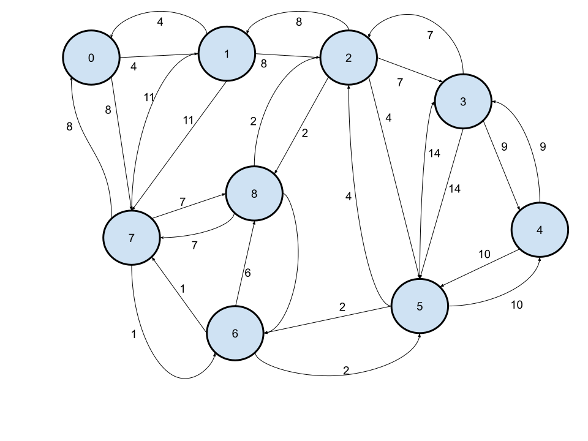

# 🛤️ Dijkstra's Algorithm
- The [CODE:📑](../Data_Structures/Dijkstras.c).
- The Shortest path algorithm that uses BFS logic i.e Greedy approach.

## 🔢 Algorithm
- The algorithm is as follows for single Source problem.
1. Start
2. Initialize the distance field for source to 0 and other to Infinity and initialize all Visited Field to 0 on 'S'.
3. Enqueue all the vertices into a priority Queue with highest priority for the smallest distance field value.
4. Repeat Steps 5-11 until Q is empty.
5. The distance values of vertex that is not in Queue Q is valid.
6. Dequeue the highest priority vertex into v.
7. Do steps 8-11 for each vertex w that are adjacent to v and in the priority queue.
8. Let 'cumulative' be the sum  of v distance feld plus the weight of the edge from v to w.
9. If cumulative is less than w's distance field, do step 10-11, otherwise go back to step 3.
10. Assign cumulative to w's distance field.
11. Add v to S.

## 📝 Pseudo Code
```
Dijkstras(G, w, s) {
    for each vertext v ∈ V
        d[v]= ∞;
    d[s] = 0;
    S = Φ;
    Q = V;
    while (Q != Φ) {
        u = Minimum from Q and delete;
        S = S ∪ {u};
        for each  v adjacent to u
            if (d[v] > d[u] + w(u,v)) then 
                d[v] = d[u] + w(u,v);
    }
}
```

&nbsp;
# [Tracing 🚧](./DijkstrasTracing.md)
- 
- Given an unsorted array like below, The sorting can be traced as: [Tracing:🧭 🚧](./DijstrasTracing.md).