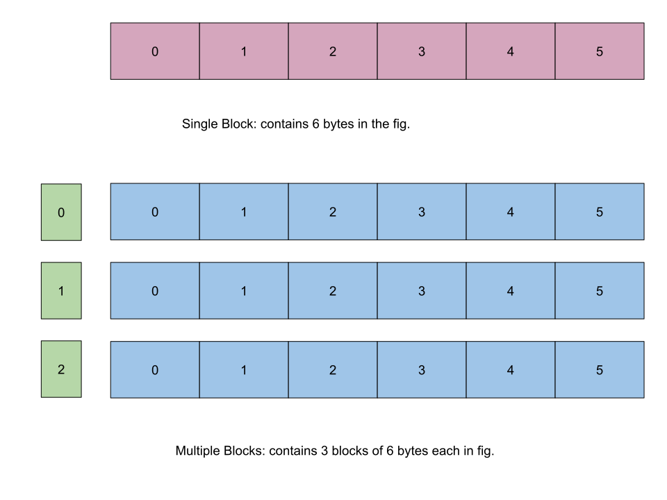

# Introduction
- Consists of exercises to understand the C functions to allocate and dellocate memory spaces
- The functions to allocate memory spaces
    1. [malloc](#malloc): to reserve a single block of memory.
    2. [calloc](#calloc): to reserve multiple blocks of memory and initially set them to 0;
    3. [realloc](#realloc): to reallocate the already allocated spaces.
    4. [free](#free): used to free the reserved spaces. will be used on every example.
    

## malloc:
- The [CODE](../Preliminary_Practices/memory_alloc.c).
- Reserves a block of memory with fixed size of bytes:
- **Syntax**: 
    ```c
    ptr=(cast_type *)malloc(byte_size);
    ```
- **Examples**:
    ```c
    ptr=(int *)malloc(size * sizeof(int));
    ```

## calloc
-

## realloc
-

## free
-