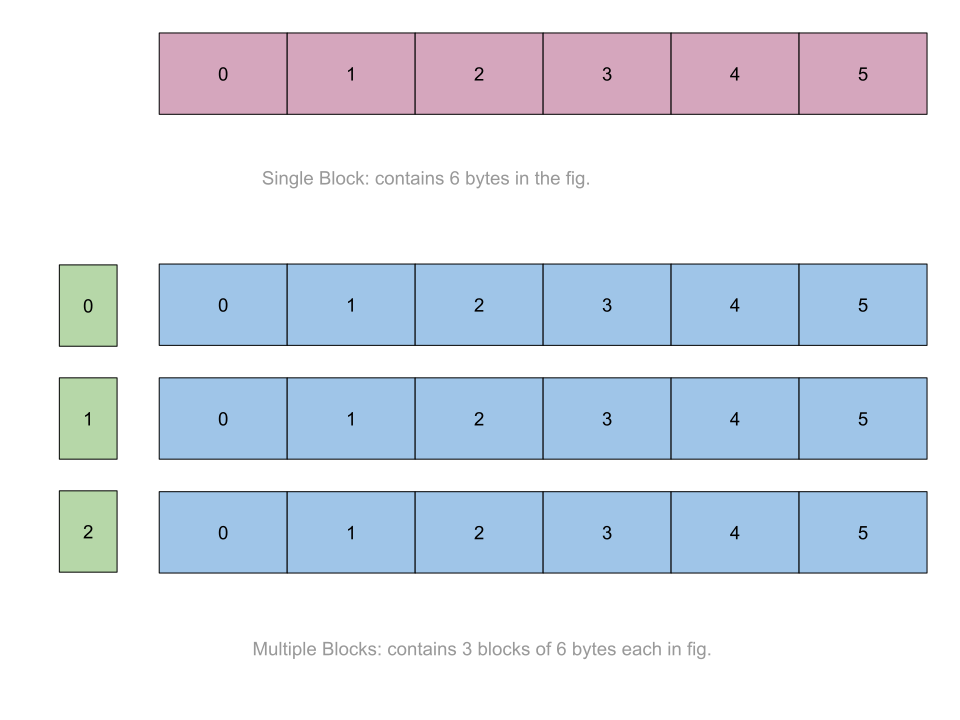

# 🧠 Memory Allocation
- The [CODE:📑](../Preliminary_Practices/memory_alloc.c).
- Consists of exercises to understand the C functions to allocate and dellocate memory spaces
- The functions to allocate memory spaces:
    1. **[malloc](#1️⃣-malloc)**: To reserve a single block of memory.
    2. **[calloc](#2️⃣-calloc)**: To reserve multiple blocks of memory and initially set them to 0;
    3. **[realloc](#3️⃣-realloc)**: To reallocate the already allocated spaces.
    4. **[free](#4️⃣-free)**: To free the reserved spaces. will be used on every example.
    
    

&nbsp;
# 🌿 Allocations
## 1️⃣ malloc:
- Reserves a block of memory with fixed size of bytes:
- **Syntax**: 
    ```c
    ptr=(cast_type *)malloc(byte_size);
    ```
- **Examples**:
    ```c
    ptr=(int *)malloc(size * sizeof(int));
    ```

## 2️⃣ calloc
- Reserves a block of memory with fixed blocks of memory:
- **Syntax**: 
    ```c
    ptr=(cast_type *)calloc(size,element_Size);
    ```
- **Examples**:
    ```c
    ptr=(int *)calloc(size,sizeof(int));
    ```

## 3️⃣ realloc
- Rellocates memory allocated with malloc or calloc.
- **Syntax**: 
    ```c
    ptr=realloc(ptr,new_size);
    ```
- **Examples**:
    ```c
    ptr=realloc(ptr,new_size*sizeof(int));
    ```

## 4️⃣ free
- frees memory allocated with malloc or calloc.
- **Syntax**: 
    ```c
    free(ptr);
    ```