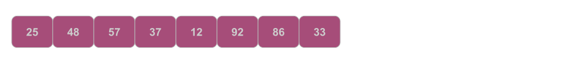

# 🫧 Bubble Sort
- The [CODE:📑](../../Data_Structures/Sorting_Algorithms.c#L39).
- The Simplest, In-Place and Stable Sorting Algorithm.
- Sorts by repeatedly swapping the adjacent elements if they are in the wrong order.

## 📝 Pseudo Code
- The Pseudo Code for ascending Sort is as follows.
```
BubbleSort(A, n) {
    for i from 0 to n-1 {
        for j from 0 to n-i-1 {
            if (A[j] > A[j+1]) {
                swap(A[j], A[j+1]);
            }
        }
    }
}
```

&nbsp;
# [Tracing](./BubbleSortTracing.md)
- 
- Given an unsorted array like below, The sorting can be traced as: [Tracing:🧭](./BubbleSortTracing.md).
