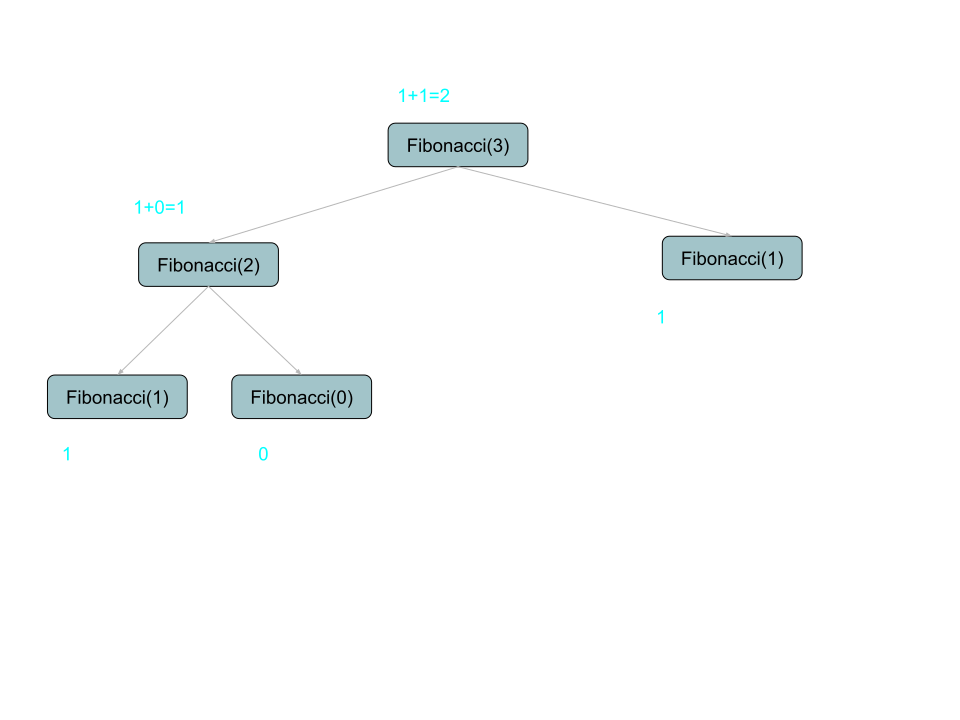

# 🐇 Fibonacci
- The [CODE:📑](../../Miscellaneous/Fibonacci.c).

### ✏️ Details
- **Initial State**: 
    1. Given 'n' number of terms to find the fibonacci numbers.
    2. Fibonacci for the first and second term are 1 (base condition);
- **Objective**: 
    1. Get Fibonacci number by adding previous two finbonacci numbers;

&nbsp;
# 🌊 Flow / Tracing
