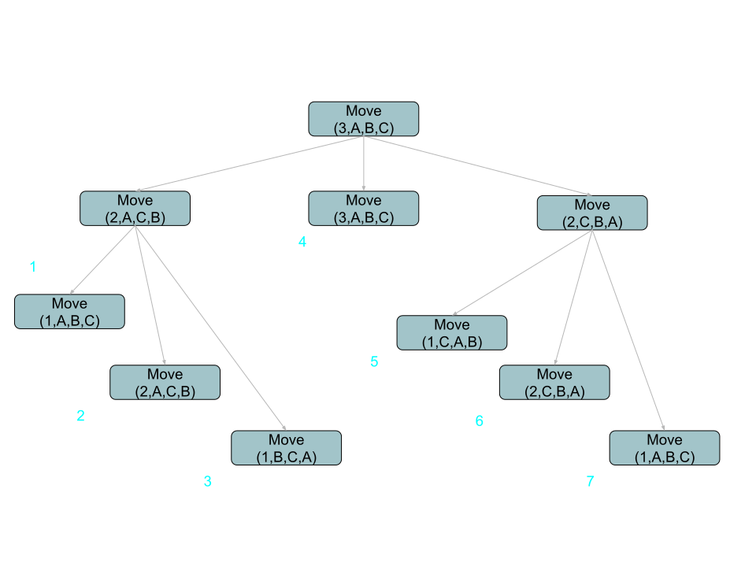

# 🏗️ Tower of Hanoi
- The [CODE:📑](../../Miscellaneous/Tower_of_Hanoi.c).

### ✏️ Details
- **Initial State**: 
    1. **Poles**: 3 Poles: Source, Destination, Temporary.
    2. **Disks**: Given n number of disks stacked in decreasing order in the Origin/Source Pole.
- **Objective**: To move all disk from Source to Destination on the condition that while moving
    1. Only one disk can be moved at a time.
    2. Each disk must always be palced around one the pole.
    3. A disk with larger value cannot be placed over one with a lower value.

&nbsp;
# 🌊 Flow / Tracing
